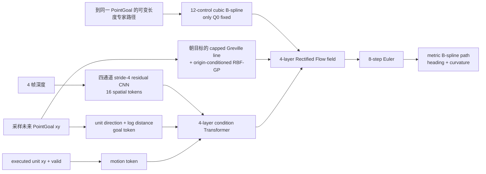

# CurveNav 架构说明（唯一事实来源）

状态：`v3` PointGoal—轨迹监督对齐已通过训练与 held-out 门禁，等待 matched 闭环；旧 `v2-A` 仅作冻结基线；stage-2 critic 仍是旧基线的 train-only 原型
最后更新：2026-08-20

本文档是 CurveNav 当前模型、数据和数学协议的唯一事实来源。改变输入字段、坐标系、轨迹边界、Flow
源分布、采样器或训练阶段时，必须在同一修改中更新代码、测试、本文件与 checkpoint contract。旧实现
只保留实验结论，不在生产代码中保留兼容开关。

## 1. 当前目标

第一目标是在统一、无损且固定的 PointGoal quick-100 闭环协议上达到 NavDP。比较对象必须使用相同场景、
episode ID、seed、相机、MPC、成功阈值和超时；训练 loss 与离线 ADE 只作为调试信号，不能代替闭环 SR/SPL。

当前只处理地面机器人的二维局部导航：`x` 向前、`y` 向左、位置单位为米。模型根据四帧深度、PointGoal
和真实执行运动生成多条平滑局部路径。

固定原则：

- 不把 GT 或预测轨迹强制成 2.1 m，也不投影到其他固定弧长。
- SanD 训练的 `task_goal` 是随机采样的未来轨迹点；监督路径恰好从当前状态走到该 PointGoal。
- B-spline 只硬固定机器人原点 `Q0=(0,0)`；target 终点对应 PointGoal，但预测 `Q11` 不做硬投影。
- v3 相对 v2-A 只改变目标—target 监督关系和 checkpoint 合同。CNN、motion、Transformer、Flow、8-step
  Euler、可变窗口和训练配方保持不变，以便单变量归因。
- v3 使用 checkpoint format 11；format-10 及更早模型只能用于显式离线基线，生产加载必须严格拒绝。

## 2. 唯一端到端链路



源均值朝向 PointGoal，但它只是 ODE 初始分布，不是输出约束。采样后的终点可以停在目标前、向侧面绕障，
或者在必要时产生与目标直线方向不同的局部动作。

## 3. 张量与坐标协议

| 对象 | 形状 | 当前 v3 语义 |
| --- | ---: | --- |
| `depth` | `[B,4,1,168,224]` | 从旧到新；物理深度经唯一预处理归一化 |
| `task_goal` | `[B,2]` | 采样未来点的当前机器人系米制 XY |
| `motion_context` | `[B,3]` | `[executed_unit_dx, executed_unit_dy, valid]`；v2-B 前保持不变 |
| target dense path | `[B,64,2]` | 到该 PointGoal 的真实可执行路径，弧长可变 |
| target controls | `[B,12,2]` | cubic B-spline，只有 `Q0=(0,0)` 是公共边界 |
| Flow state/velocity | `[B,12,2]` | 第 1–11 个控制点全部参与随机源、速度损失和积分 |
| depth tokens | `[B,16,256]` | 四帧仍在第一层卷积融合；v3 不改视觉结构 |
| condition memory | `[B,18,256]` | goal + motion + 16 depth tokens |
| prediction | `[B*N,64,2]` | 米制局部路径，终点自由 |

PointGoal 编码令 `r=||g||`，唯一 goal feature 为：

```text
[g_x / max(r,eps), g_y / max(r,eps), log(1+r)]
```

`r≈0` 时方向置零。这同时保留目标方向和远近信息，不对距离设置固定目标尺度。

## 4. 数据合同

对任意 anchor `t`，唯一 SanD 采样合同为：

```text
end          ~ Uniform(t + min_gap, ..., min(t + max_gap, run_end))
task_goal_t  = transform_to_robot_t(expert_route[end])
target_t     = transform_to_robot_t(expert_route[t : end])
target_t[-1] = task_goal_t
```

窗口长度仍由 `min_gap=5`、`max_gap=42` 和 run 剩余长度决定，模型自行学习轨迹距离与曲率；不存在 2.1 m
截断。训练保留 SanD 原有按 worker seed 的随机窗口，held-out validation descriptor 始终固定。本轮除
`task_goal` 从 run 最终点改成已采样 `end` 点外，不改变样本集合、网络或优化配方。这恢复了 SanD 官方
`run_train.sh`/loader 的核心合同：随机 `start_idx/end_idx`，`end_relative_pose` 与监督轨迹使用同一个 `end_idx`。

旧 v2-A 的“run 最终目标 + 随机局部前缀”已被数据审计否决：目标距离中位数约 17.28 m，目标—target
方向差中位数约 52.81°，66.27% 样本方向差超过 15°；局部深度无法解释这类监督冲突。旧 HSSD v2 bundle
仍保留作 critic/数据审计资产，但未转换为上述 v3 合同前，不混入当前 stage-1 policy 训练。它固定输出为：

当前开源 `dataset_avoid` 不是论文完整 500-episode 训练集：loader 只识别 151 条有效 run，其中 135 train、
16 validation。v3 的 15,000 updates/global batch 512 产生约 7.68M 次样本抽取，但这些重复抽取不会增加
场景、障碍拓扑或恢复状态覆盖；因此训练 loss 和同分布 held-out ADE 不能证明闭环泛化。

- 200 条完整 episode，约 160 train / 40 validation，scene family 隔离；
- 无损物理深度、完整相机 K/外参、`distance_to_image_plane` 定义和 invalid 规则；
- `task_goal_local_xy`、`history_indices[4]`、固定 target descriptor、真实弧长；
- `motion_se2[4,5] = [dx,dy,sin(dyaw),cos(dyaw),valid]`，供 v2-B 使用；
- 连续 footprint clearance、曲率、重复与 split 泄漏审计；
- `alternative_candidates=[]`、`critic_labels=null`，不复制单一路径伪造多模态监督。

HSSD v2 的正式加载只走一条 packed-bank 链路：原始 `float32` 米制 depth 是不可变数据真值；一次性使用与
部署相同的预处理生成 `float16 [frame,168,224]` 帧库，并用 episode frame count 与原始 depth SHA256 严格
校验。训练批次只搬运 `depth_indices` 和监督 tensor，GPU 常驻帧库再执行 index-select；不存在逐样本读取、
resize 或 raw-depth fallback。`sample_index` 是 descriptor 的稳定索引，字符串元数据只在 batch 外解析。

v3 的 `motion_context` 必须从原始相邻姿态 `anchor-1 -> anchor` 计算，在当前 anchor body frame 表达并归一化；
首帧 valid 为 0。HSSD descriptor 内的 `history_motion_se2` 是间隔 3 个原始步长的 selected-frame SE(2)，只为
v2-B 时序结构保留，不能代替当前 motion 输入。HSSD、SanD 和部署 runtime 对同一位移的单元测试必须一致。

`curvenav_critic_sidecar_v1` 是独立监督层，不修改上述 observation 数据。它按 `sample_id` 引用 HSSD v2，
每个状态保存 8 个固定 EMA/seed 的真实 policy 候选、1 个 expert 和 1 个 hold，以及 collision、额外 clearance、
测地 progress、曲率和运动学 proxy。偏好只在 collision / safety margin / progress / clearance 上形成严格
Pareto dominance，不写加权总分。当前 policy/expert/hold 都没有经过 corridor graph 认证，因此 topology、
branch 和 corridor edge 必须保持 null/empty；MPC closed-loop 标签保持 `not_run`，不能拿离线 proxy 冒充。
sidecar 的 schema、producer revision/seed、candidate ID、ragged offset、源数据 SHA 和 packed-depth SHA 由唯一
reader/validator 锁定。

下一批正式数据不能靠重复窗口扩大数字，必须同时满足以下合同：

- observation、相机、机器人坐标、最终 task goal 与控制器版本完全匹配；
- 同一状态保存多条由真实可行 corridor/ordered-edge sequence 区分的路径，不用旋转或噪声伪造拓扑；
- 保存冻结 policy 在该状态生成的 hard negatives，以及 collision、margin、progress、clearance 原子标签；
- 纳入闭环偏离专家后的 recovery/DAgger 状态，不能只采专家路径上的干净 anchor；
- train/validation/test 按 scene family 隔离，任何 sample、depth frame、route 前缀均不能跨 split；
- observation bundle 是不可变真值，候选/critic 标签只用全局 sample ID 外键引用，不复制 depth；
- topology 或 closed-loop 标签只有在对应 planner/MPC 确实运行后才能非空，未知值不生成伪监督。

多专家训练的采样单位必须是“状态”而不是“路径”：先均匀采样 state，再在该 state 的真实可行 topology experts
中均匀采样一个 target。否则候选多的简单状态会隐式获得更大权重，且重复路径会伪装成数据扩容。Flow 仍学习
单一条件分布，不为 topology 增加类别输入或分支网络；同状态多 target 由随机源表达多模态。

旧 HSSD 约 89° FOV 深度不能用于约 67.757° 的 benchmark，相同路径几何可以复用，但深度必须重渲染。
数据集和测评端现在统一使用 float32 米制物理 depth 与 NaN invalid。测评请求只允许 raw tensor，响应只
允许 NPZ；不存在旧量化、fallback 或协议分支。

当前控制器允许 `0 <= v <= 0.5 m/s`、`|omega| <= 0.5 rad/s`，并允许 `v=0` 原地旋转；源码没有给出
正的最小稳定速度、加速度、jerk、slip 或闭环跟踪误差包络。因此不能把某个固定曲率当作物理可执行性
硬门禁。pilot 的 `p95<=4`、`max<=10 m^-1` 只保留为数据质量启发式；模型侧必须在 matched 闭环中监控
曲率、MPC 降速/饱和和跟踪误差。

## 5. 轨迹与 Flow 数学

### 5.1 B-spline

使用 `K=12` 个控制点、次数 `p=3` 的 clamped open-uniform B-spline：

```text
tau(u) = sum_i B_i,3(u) Q_i,  u in [0,1]
Q0 = (0,0)
Q11 = learned local endpoint
```

target 路径先按完整真实弧长重采样为 64 点，再做“以 target 自身末点为边界”的最小二乘拟合。v3 中该
专家末点就是 PointGoal；解码时只重新置零 `Q0`，不会把预测 `Q11` 覆盖为 PointGoal。

### 5.2 归一化与条件源

控制点继续使用唯一 scale-only normalizer `s=(5.6,2.5)`；它不 clamp 预测。给定 PointGoal `g`：

```text
d       = g / max(||g||, eps)
h       = min(||g||, 5.6 m)
g_ref   = h d
mu_i    = Greville_i * normalize(g_ref)
```

所以近目标时源均值到真实目标，远目标时源均值只提供一个 5.6 m 的朝向先验。输出终点不受 `g_ref` 约束。

RBF-GP 残差只条件化机器人原点为零。设 `O={0}`、`F={1,...,11}`：

```text
Sigma_F|O = K_FF - K_FO K_OO^-1 K_OF + 1e-6 I
Z_0       = 0
Z_F       = mu_F + chol(Sigma_F|O) epsilon * sigma_xy
sigma_xy  = (0.04, 0.12)
```

v3 保持原轴向标准差，以隔离目标—target 语义变化；pilot 完成后只通过数据统计决定是否单独开展源方差
实验，不能在推理时调参。

### 5.3 Rectified Flow

归一化专家控制点为 `X`，条件源为 `Z`，二者只共享原点：

```text
t ~ Uniform(0,1)
X_t = (1-t) Z + t X
U_t = X - Z
L_FM = mean_{i=1..11} ||v_theta(X_t,t,C)_i - U_t_i||^2
```

网络输出和每个 Euler step 只把第 0 个速度/控制点置零。终点速度属于训练目标，采样终点属于完整随机变量。

## 6. 模型结构与训练配方

v3 为严格单变量实验，以下结构保持原样：

- 四帧作为四个输入 channel 的 residual CNN，输出 `4×4=16` token；
- goal、motion、depth 进入 4 层 pre-norm condition Transformer；
- 12 个 trajectory token 进入 4 层 self/cross-attention Flow field；
- condition K/V 在 8 个 Flow step 中只计算一次；
- 8-step explicit Euler；几何解码固定 FP32；
- 两卡 DDP、FP16 GradScaler、fused AdamW、global batch 512、gradient clip 1.0、EMA；
- 当前宿主的 NCCL P2P collective 经最小复现确认会自旋，训练固定使用已验证通过的 SHM collective；
- 每配方 15,000 optimizer updates，checkpoint 原子覆盖一个恢复文件。

checkpoint format 为 11，contract 至少锁定：

```text
goal_semantics   = sampled_future_point_goal_robot_xy
sand_supervision = target_endpoint_equals_point_goal
endpoint_policy  = learned_local_endpoint_origin_only
arc_length       = learned_unconstrained
flow_source      = task_goal_capped_greville_line_origin_conditioned_rbf_gp
dimensions       = 2
```

### 6.1 Standalone stage-2 trajectory critic

现有 stage-2 实验不改变或反传旧 v2-A policy。冻结 EMA policy 对每个状态产生的 condition memory 只编码一次，并按稳定的
全局 `sample_index` 缓存为 FP16 token；后续 epoch 的 loader 只搬运 10 组控制点和原子标签。当前 pilot 为
9,659 train / 2,551 validation states，两卡 global batch 256。这样既严格复用生成候选时的视觉条件，又不在
40 个 epoch 中重复运行冻结 CNN/Transformer。

每个候选的 12 个米制 B-spline 控制点按 policy 的 `(5.6,2.5)` scale 归一化，加入 trajectory CLS/position
embedding，经过 2 层 candidate-shared self-attention 与对 condition memory 的 cross-attention。candidate kind、
producer slot、sample ID 均不进入模型；打乱候选顺序时输出必须同样置换。模型输出：

```text
s_i       = pairwise ranking score
c_i       = collision logit
m_i       = safety-margin-violation logit
p_i       = normalized geodesic progress
d_i       = minimum extra clearance
```

sidecar 只存明确的 Pareto pair，不存加权 utility。主损失按状态等权，避免 pair 多的状态支配梯度：

```text
L_pair = mean_b [ mean_(w,l in P_b) softplus(-(s_w-s_l)) ]
L      = L_pair + 0.25 * mean(L_collision, L_margin, L_progress, L_clearance)
```

四个辅助头分别使用 BCE/BCE/Huber/Huber；progress 只在 geodesic label 有效时计算。E026 已证明单独
`argmax(s_i)` 会学到 Pareto 排序却牺牲安全，因此最终唯一选择是无权重的严格字典序：

```text
1. 若存在 c_i < 0 的 policy candidate，只保留这些预测 non-collision 候选；
2. 在剩余候选中若存在 m_i < 0，只保留这些预测 margin-safe 候选；
3. 返回剩余候选中 argmax(s_i)。
```

这不是可调 scalar cost，也没有部署开关。已有 critic checkpoint format 1 严格绑定旧 policy format-10，不能
与 v3 policy 交叉加载。当前 critic 只保留为历史 train-only 原型；v3 stage-1 达到 SanD 后，必须用冻结的
format-11 policy 重新生成候选与 condition cache，才允许进入新的 stage-2。

## 7. 推理与选择

部署接收 benchmark 给出的机器人系 PointGoal；训练阶段把每个随机未来点视作一个独立 PointGoal episode，
部署则通过闭环重规划处理更远目标。policy 一次采样 8 条自由终点路径；当前唯一 selector 先按观测深度筛选
footprint-safe 候选，再最大化候选终点对 PointGoal 的欧氏距离缩减，最后用长度和 bend 破同分。预测终点
没有硬投影；若路径提前停止，下一控制周期继续重规划。该确定性安全层不宣称能处理未知空间、长墙或死胡同。

后续若同一候选集的 simulator-truth oracle 显著高于当前 selector，应优先改评价；若 oracle 也低，说明生成器
没有覆盖安全拓扑，应先生成同状态多拓扑专家数据。critic 不以可选开关形式塞进当前监督模型。

现有 HSSD sidecar 和固定批门禁已证明 critic 数据链可用，scene-heldout 训练用于验证结构，但它仍不是“已启用
critic”：当前部署只有确定性 depth selector。只有用 v3 policy 重建数据且离线安全/排序指标和 matched
closed-loop 都通过，才允许用唯一 critic selection contract 原子替换现有 selector；否则 sidecar 只用于生成
覆盖与失败分布诊断，不改变 v3 stage-1 policy。

使用原始 `360×640 float32` 当前帧重放现有 `DepthSafetySelector` 的离线审计显示：12,210 个 HSSD 状态中，
28.59% 的选择被另一条 policy 候选严格 Pareto 支配；16.67% 的全部状态在存在非碰撞 policy 候选时仍选中
碰撞路径，17.00% 在存在 margin-safe 候选时仍选中 violation。该结果只证明 selector 存在可学习空间；HSSD
navigation grid 不是 simulator truth，也没有 MPC 执行标签，因此不能据此跳过 matched quick-100 门禁。

当前 `hard_0` episode 0–9 的诊断闭环为 SR 40%、SPL 0.3546、碰撞率 20%、stuck 6/10。该 10 条样本只
证明完整 format-10/EMA/Flow/selector/MPC 链可以成功，也暴露主要失败终止为 stuck；它不足以单独区分
“候选覆盖不足”和“存在好候选但 selector 选错”。这是旧 format-10/v2-A 基线证据；最终归因必须读取候选级
trace 或 simulator-truth oracle，不能用总体 SR 代替。

## 8. 单变量迭代门禁

每一轮都按以下顺序，结果与失败经验写入 `EXPERIMENTS.md`：

1. schema、坐标、相机、连续 footprint、split 泄漏审计；
2. 全量单元测试；
3. 固定 8-sample batch 过拟合，证明数据—Flow—梯度链可学；
4. 固定时间预算 pilot training，比较 held-out loss、ADE、候选多样性、吞吐和显存；
5. 只有前四项通过才训练完整权重；
6. EMA/contract smoke 后跑完全相同的 quick-100；
7. paired episode 比较 SR/SPL、碰撞、stuck 和 oracle gap，决定 keep/discard。

quick-100 只有 100 条，SR 的随机误差不小。保留决定必须优先看同 episode 的配对改善，并要求安全指标不显著
退化；最终“达到 NavDP”以同一修复协议下 SR/SPL 不低于 NavDP 为准。
