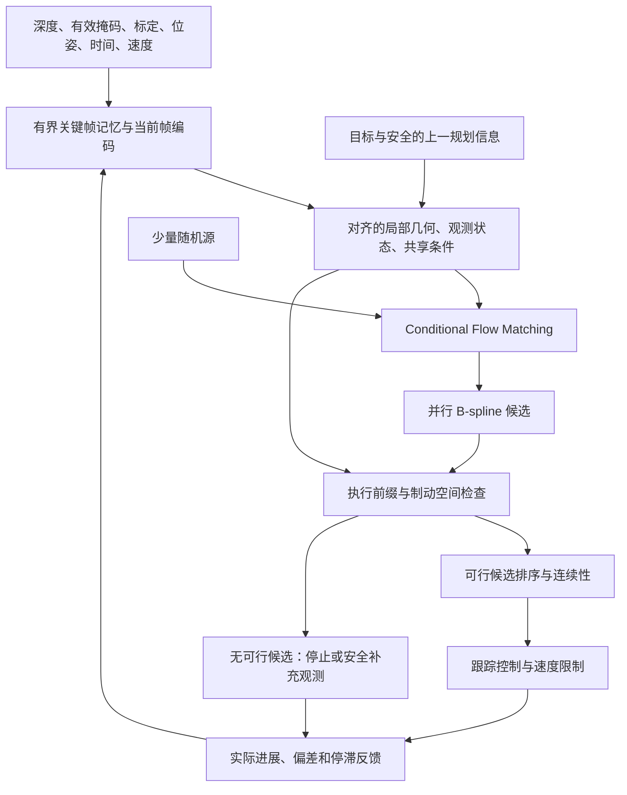

# CurveNav 训练、规划与闭环架构审计

本文记录重构前的审计快照；当前实现以 [ARCHITECTURE.md](ARCHITECTURE.md) 为准。原始源码已保存在 `outputs/rgbd-memory-20260910/source-before.tar.gz`。

日期：2026-09-10。范围：本地 CurveNav 源码、配置、实验记录，以及 general-navigation-benchmark 中的策略接入、异步规划和控制链路。此文是重构决策稿，不代表新架构已经实现或取得新的测评成绩。

## 1. 结论与证据边界

建议重构，但保留已有的米制几何、B-spline 轨迹表示、数据契约与训练状态管理。优先修正观测可信度和闭环执行，再建立简单的 Conditional Flow Matching 基线，最后压缩推理步数。不要继续仅通过更换注意力锚点和降低离线 ADE 来判断导航能力。

当前系统实际上是：**距离采样的四帧深度与目标 → 局部几何及视觉条件 → 固定噪声的一步 iMF → 单条曲线 → 外部跟踪 MPC**。训练中的可见障碍损失承担了过多责任；部署没有独立的轨迹可行性检查、候选选择和明确的恢复机制。

证据分为三类：

- **已复现行为**：本次 CPU 探针与测试结果；可直接用于修复验收。
- **源码确定的机制**：例如固定推理源、未知区不参与安全损失、MPC 没有障碍约束。机制存在不等于已证明它造成了某次分数下降。
- **历史记录与待验证假设**：EXPERIMENTS.md 的成绩、旧轨迹统计、分布偏移和架构取舍。本地没有这些实验的完整 checkpoint、准备后训练集和回放日志，不能独立复现历史得分，也不能给各原因分配贡献比例。

当前目录没有 Git 元数据，不能从目录名称推断精确历史版本。ARCHITECTURE.md 描述 E014，而 base.yaml 的输出目录仍叫 E013；后续实验必须绑定源文件、数据、配置和权重摘要，不能用目录标签代替版本证据。

## 2. 从专家数据到实际动作

| 环节 | 当前行为 | 保留什么 / 主要缺口 |
|---|---|---|
| 专家路线 | HSSD 20 场景，16/4 场景划分，计划 500 条路线；配置空间 A*、简化和平滑，0.15 m 采样 | 有明确机体尺寸和安全距离；观测主要来自安全路线上的切向姿态，缺少偏航、偏离路线和恢复状态 |
| 传感器观测 | 按路线姿态摆放相机并渲染深度；固定相机外参 | 标定契约值得保留；没有真实控制过程产生的状态分布、时间和速度信息 |
| 样本准备 | 每锚点取 24 个未来步，当前机体坐标；目标是任务终点；历史间距 0.45 m | 目标与局部终点语义区分明确；没有在此路径看到恢复数据或目标重标注 |
| 轨迹标签 | 8 个三次 B-spline 控制点，首点固定原点，14 个自由增量坐标；解码 64 点 | 低维连续表示合适；投影误差和净空过滤可能剔除困难样本，应检查被拒绝样本的场景、曲率和绕行分布 |
| 深度处理 | 重投影为 126×224，截断到 5 m；无效深度与视场外都填最大值 | 校准重投影不是简单缩放；无效、未覆盖和可靠远距离回波没有区分 |
| 条件编码 | 共享深度 CNN；四帧 SE(2) 对齐；5×64×64 配置场；16×16 几何/视觉记忆及运动 token | 米制、多帧几何融合有价值；栅格特征中心不一致，历史不含真实时间，停车/转向记忆失效 |
| 生成训练 | 384 维、12 层解码器；瞬时速度与平均速度分支；iMF 的 JVP 修正 | 并非尚未使用 flow；当前已经是一步 improved MeanFlow，训练复杂度较高 |
| 安全训练 | 部署边界样本上计算可见配置空间净空损失 | 能约束已有障碍证据；不覆盖未知区域，也不能代替运行时安全检查 |
| 优化与保存 | AdamW、warmup/cosine、梯度裁剪、AMP、EMA；全局 batch 1024、8000 次更新 | 按成功参数更新推进 LR/EMA、保存优化器/随机数/AMP 状态等应保留；实验包还需显式绑定数据和源码摘要 |
| 在线推理 | 固定源向量，一次调用产生一条曲线；取未来 63 点返回 | 稳定、接口简单；没有多候选、执行前验碰和速度/有效期输出 |
| 控制与测评 | 异步策略请求 → 外部 MPC → 动作队列；回合代号拒绝跨回合结果 | 已有规划与控制记录可复用；同回合延迟轨迹缺少时间有效性检查，跟踪器本身不检查障碍 |

主要入口：

- [专家生成](src/curvenav/data_generation/generate.py)，[样本准备](src/curvenav/data/prepare.py)，[数据加载](src/curvenav/data/loader.py)。
- [深度预处理](src/curvenav/data/depth.py)，[几何投影](src/curvenav/encoders/geometry.py)，[BEV 融合](src/curvenav/encoders/configuration.py)。
- [策略与损失](src/curvenav/models/policy.py)，[安全损失](src/curvenav/models/safety.py)，[训练循环](src/curvenav/training/train.py)，[checkpoint](src/curvenav/training/checkpoint.py)。
- [在线运行时](src/curvenav/deployment/runtime.py)，[测评规划线程](/shibo_huang/general-navigation-benchmark/navbench/scene_evaluator.py)，[当前冻结的外部 MPC](/shibo_huang/general-navigation-benchmark/.runtime/x-navdp-878740a20118/baselines/x-navdp/src/utils/mpc_tracking.py)。

## 3. 优先问题

### P0：观测缺失会制造错误的已知区域

`data/depth.py:118` 将 NaN、无穷和非正深度替换为最大量程；重投影视场外也如此。`encoders/geometry.py:466` 将池化表面有效性设为全真，随后参与射线观测区域构造。

本次探针中，全 NaN 深度与正常最大量程输入得到相同的预处理结果；最终产生 **498 个已观测格子、0 个占用格子**。这不是证明真实场景中这些格子都有障碍，而是证明系统已无法区分传感器失效与可信观测。

修复需贯穿原始数据、缓存、预处理、几何射线与线上接口：保留独立有效掩码；根据传感器定义区分有效无回波、超量程和无效像素。未知区不得因填充值变成确认可通行区。旧缓存已丢失的信息不能靠更改网络恢复，需要重新生成对应缓存。

### P0：安全只在训练损失里，没有形成执行闭环

`models/safety.py:11` 仅对已观测支持的轨迹点计算净空惩罚；全未知路径的损失为 **0**。这是合理的“缺少证据就不给伪几何梯度”，但如果线上直接执行，则不构成安全保证。`models/policy.py:342` 解码后直接返回，外部 MPC 的优化约束也没有障碍项。

应独立检查实际准备执行的短前缀及控制器预测轨迹：机体扫掠范围、净空、观测可信度和制动距离。长路径可进入暂未知区域用于表达探索意图，执行段必须有与当前速度匹配的可观测停止空间；否则减速、补充观测或停止。

未知区不能全部视作自由，也不能通过全程停车“优化碰撞率”。验收必须同时考察任务进展、停滞和成功率。在遮挡、动态障碍和深度失效条件下，只能给出明确假设下的风险控制，不能宣称绝对无碰撞。

### P1：BEV 三种空间采样中心不一致

`encoders/configuration.py:51` 的两层 stride=2、kernel=3、padding=1 卷积，将 64 格变成 16 格。输出名义中心落在原栅格索引 `4j`；`_metric_grid` 则用覆盖完整边界的 16 点 linspace，相当于原索引 `4.2j`。在 [-3.6, 3.6] m 范围内，最大单轴差为 **0.342857 m**。视觉 splat 使用后一套网格；observed_fraction 的 adaptive pooling 又对应另一组聚合中心。

这是可复现的几何融合不一致，不应表述成“所有输出轨迹确定平移了 34 cm”。需要统一特征中心、视觉落格和可见性聚合的物理定义，并以已知障碍点、边界和 SE(2) 变换验证。它会改变模型输入语义，应单独版本化与重训，不能无说明套用旧权重比较成绩。

### P1：停车和原地转向时，历史既浪费内存又丢信息

`deployment/runtime.py:72` 每次请求追加一帧，按累计平移距离裁剪和选帧。原地请求 200 次后保留 **200 帧、约 21.5 MiB 深度数组**，模型却只有 **1 个有效历史帧**。原地转头时距离也不增长，过去方向的观测无法按当前规则有效保留。

短期先限制缓冲增长且保持现有移动选帧语义；后续统一训练与部署关键帧策略：平移、转角和最大时间共同决定保留，附真实时间戳，并限制容量。不能只改线上历史策略而不调整训练分布。

### P1：示范分布没有覆盖闭环会进入的状态

专家生成使用平滑路线及其切向朝向。训练学习的是“沿正确路线继续走”，而闭环必须处理“已经朝错、贴墙、被控制器带偏、绕行中目标在侧后方”。数据的安全过滤本身必要，但若难转弯被大量过滤，模型会进一步偏向容易前进的样本。

应统计过滤前后分布，再补：实际扰动姿态下重新渲染且重新规划的专家、偏离路线恢复、可执行转向、目标附近停止及失败回放再标注。简单旋转标签而保留原深度，会破坏传感器和动作一致性。静态 HSSD 路线也不能作为动态避障已具备的证据。

### P1：单条固定源轨迹没有备选与失败处理

训练包含 50% 对角时间样本、25% 内部区间及 25% 精确部署边界；部署边界源与推理一样固定。部署只生成一个结果，没有可行候选集合，也没有 previous-plan、停滞时长或执行反馈作为明确状态。

固定源有利于重规划稳定；问题是遇到条件歧义或同一局部失败时，缺少备选和切换依据。这不证明 MeanFlow 必然失败。改成多候选需要训练分布支持随机源；不能仅给旧模型换几个 seed 就认为完成改造。

### P1：离线评估和实时测量没有回答实际执行的问题

运行时计时开始于输入准备之后，结束于 GPU 输出 `.cpu().numpy()` 同步之前，不能作为完整端到端延迟。测评线程的策略墙钟时间更完整，但仍需看完整规划和执行链。

异步线程拒绝跨回合结果，却没有对同回合轨迹的观测年龄、位姿漂移作处理；新算出的控制序列从第 0 项开始发布。已有队列耗尽后不会无限维持上一动作，这是应保留的行为。是否发生严重延迟偏差，需要实际轨迹和时间记录验证。

B-spline 的空间光滑性也不保证给定速度下满足角速度、加速度或曲率约束。安全检查需要覆盖实际跟踪结果，而不只检查稀疏的几何参考点。

## 4. 如何解释“成绩越来越差”

以下均为 [EXPERIMENTS.md](EXPERIMENTS.md) 的历史记载，不是本次重跑结果：

| 实验 | 条件与记录 | 可以得出的结论 |
|---|---|---|
| E008 | 固定 Home 前 10 回合、seed 1234、B1；SR 6/10，SPL 0.582788 | 当前记录中应保留的已验收参照；样本量不足以代表总体表现 |
| E010 | 同一小测 B1；SR 3/10，SPL 0.298922 | 在该运行条件下发生退化，但不能归因于文档早期的注意力锚点解释 |
| E008 vs E010 的更正 | 记录确认 policy.py 字节相同；BF16 / batch 1024 / 8000 更新 vs FP16 / batch 1792 / 4600 更新 | 更新数减少 42.5%，同时精度和 batch 改变；不是干净的架构对照 |
| E011 | 离线 ADE 0.03713 m；B10 在线 SR 1/10 | 离线拟合好不等于闭环成功；B10 不能直接与 B1 排名 |
| E012 | 离线 ADE 0.03124 m，首米碰撞率 0.247%；B10 在线 0/10，全超时 | 继续改善离线指标没有解决运行分布上的导航；不同数据分布和执行链必须分别诊断 |

E011 的冻结回放记录中，首米路径进入不可通行区的比例为 97.64%，停滞比例 73.77%，相邻首米规划差仅约 3.59 mm。若拿到相应回放，应先验证坐标对齐与起点可通行标注，再定位为什么“稳定地产生不可执行意图”；不应先把问题归为采样抖动。

E012 记录 68.24% 的碰撞轨迹在碰撞处缺少四帧深度证据；首米碰撞的 15 条也都未观测。这个现象支持优先研究可观测性和安全执行前缀，而不是单纯加大可见净空损失。

E012 B10 记录的平均策略 / MPC / 合计延迟为 200.34 / 262.27 / 462.61 ms。它表明该配置下控制求解成本不低，但不能拿来宣称 B1 也只能运行约 2 Hz。后续分别测 B1 实时性与批量测评吞吐。

## 5. 四项参考工作各取什么

| 工作 | 适合吸收的机制 | 在 CurveNav 中的落点 | 不应直接照搬 |
|---|---|---|---|
| SanD-Planner | 低维 B-spline 生成、候选采样、几何轨迹评价、上次规划信息 | 保留曲线表示，增加可行性检查与小批候选，使用安全前提下的规划连续性 | 扩散采样器不是用户指定的 Flow Matching；论文帧率不可直接迁移 |
| NavDP | 共享感知条件、候选质量预测、训练时利用特权地图产生价值监督 | 先几何筛选；如果排序仍是瓶颈，再加入有校准与失败样本的 critic | 不先堆额外 critic；训练地图监督不能泄漏到部署输入 |
| X-NavDP | 在线失败状态覆盖、候选组内质量比较、适应行为与机体差异 | 补恢复数据，之后研究候选质量加权的 FM 训练 | GQRM 的 score matching 推导不能直接改名为加权 FM；完整在线 RL 放在稳定基线之后 |
| LoGoPlanner | 时序几何和尺度一致性、定位相关的场景记忆 | 先利用已有标定深度及位姿构建可靠短期记忆，保留转头观测和有效时间 | 首版不引入大视觉几何主干；已有度量深度时要先证明额外模型的收益与代价 |

原始来源：[SanD 论文](https://arxiv.org/html/2602.00923v1)、[SanD 轨迹评价实现](https://github.com/WangJinCheng1998/sandplanner/blob/main/sand_planner/core/trajectory_evaluator.py)、[NavDP 论文](https://arxiv.org/html/2505.08712v3)、[X-NavDP 论文](https://arxiv.org/html/2607.28560v1)、[LoGoPlanner 论文](https://arxiv.org/html/2512.19629v1)、[LoGoPlanner 官方实现说明](https://github.com/InternRobotics/NavDP/blob/master/baselines/logoplanner/README.md)。检索日期为本报告日期；没有在本机复现这些论文的成绩。

参考代码同样需要审查。查阅的 SanD 轨迹评价实现中，ESDF 越界可以返回正距离，地图不可用或评价异常时可以返回第一个候选；相机偏移也不能沿用到当前机器人。借鉴其几何评价思想，不复制这些失效时继续选路的行为。LoGoPlanner 论文与当前公开实现说明的几何主干也存在版本差异，应分别记录。

## 6. 建议确定的新架构



### 6.1 先建立可解释的 Conditional Flow Matching 基线

沿用当前时间方向，令标准化专家曲线为 x，随机源为 ε：

```text
z_t = (1 - t) x + t ε
v_target = ε - x
L_FM = E[||vθ(z_t, t, condition) - v_target||²]
推理从 t=1 到 t=0：z_next = z - Δt · vθ(z, t, condition)
```

这是以 [Flow Matching](https://arxiv.org/html/2210.02747v2) 的线性条件路径建立的建议基线。先尝试 **4 个候选、4 次速度场求值**，以受控实验比较候选数量和步数。它是实验起点，不是已证明最优的配置。

保留 8 控制点和现有轨迹尺度，暂不同时改变全部表示。先用同一感知骨干比较生成目标，再依据 profile 缩减解码宽度/层数。现有 iMF 是不同训练目标与推理分布，旧 checkpoint 不应静默兼容新网络。

在少步 CFM 的闭环质量稳定后，再研究一步 MeanFlow 或蒸馏。普通 FM 的一步 Euler 没有自动保持多步质量的保证；“一次调用”也不等于端到端最快。

### 6.2 几何负责已知风险，生成器负责提出绕行方式

条件只编码一次，候选与积分步骤共享条件投影。历史视觉编码可按关键帧缓存，局部几何仍需随新观测和位姿更新；缓存必须随回合、模型和标定正确失效。

先检查候选的执行前缀，再在通过者中比较净空、任务进展、绕行代价和上一条安全规划的连续性。允许必要的暂时远离目标，不能以每一步欧氏距离递减筛掉绕障路线。不要把严重碰撞风险仅作为一个可被目标奖励抵消的软评分。

执行段的停止空间至少覆盖：

```text
s_stop ≥ v · τ + v² / (2 a_brake) + 几何与定位裕量
```

其中 τ 包含观测、规划、通信、控制及执行延迟，a_brake 来自目标机器人的可保证制动能力。还需检查 v·|κ| 与角速度上限、实际控制器预测轨迹及机体扫掠区域。动态障碍需要时间上的占据变化或明确保守假设；静态 ESDF 不足以声称完成动态避障。

无可行候选时应明确返回停止/需观测状态；转头也需确认机体扫掠安全。连续性偏好不能锁死在旧的失败路径上，检测到停滞或旧轨迹不安全就撤销该偏好。

### 6.3 记忆、局部决策与全局任务的边界

训练与部署统一关键帧和时序语义，加入真实时间及执行反馈。对于 U 形障碍或长距离绕行，局部深度加终点向量可能无法唯一确定出路，需要有限的访问/进展记忆，必要时由上游提供子目标。应明确接口和信息来源，不向局部策略偷偷提供测评真值地图。

首版用现有模块演进即可：观测与几何、轨迹生成、执行检查与排序、runtime 接入。先不建设通用 planner 插件框架，不同时加入大型语义骨干、在线 RL 和复杂恢复状态机。

### 6.4 测评协议与产品执行分开验证

官方测评的控制器、动作约束和终止规则保持冻结，用它判断策略改动；产品侧速度限制、有效期和安全监督另设明确适配与实验。当前官方路径接口不能直接表达所有速度/停止语义，必须先核对允许的协议，不通过隐式改变 MPC 来制造不可比的分数提升。

实时目标建议先设为：指定机器人与单卡条件下 **B1 完整规划 P95 <100 ms（10 Hz 预算）**，控制循环独立运行。最终目标应按实际传感器频率、速度和硬件确定。本次没有测得新架构达到此目标。

## 7. 按链路推进的顺序与验收

| 阶段 | 最小完整工作 | 通过条件 |
|---|---|---|
| 0：冻结可比基线 | 找回 E008 与最近失败版本的权重/配置/日志；绑定代码、数据摘要；锁定 episode、seed、batch、精度、更新数、控制器 | 能复现同条件结果；回放中观测、计划、实际动作及碰撞坐标对应一致 |
| 1：观测到几何 | 无效深度掩码贯通；统一 BEV 坐标；有界历史，之后加入转角与时间关键帧 | 全失效输入不产生伪已知自由区；已知点与 SE(2) 变换落格符合量化误差；长时间停车内存有界；训练/推理预处理一致 |
| 2：几何到安全执行 | 在当前生成器上先加执行前缀检查，验证控制器实际 rollout；明确无解行为 | 已知墙、窄门、未知区、突发失效、急转弯、过期结果均按定义处理；碰撞减少不能伴随普遍停车超时 |
| 3：专家到训练标签 | 分析被过滤样本；补姿态扰动、偏轨恢复和目标附近行为；重算训练集归一化 | 观测与标签几何一致；困难样本覆盖可量化；按场景隔离验证，禁止使用测评场景调训练标签 |
| 4：CFM 到候选选择 | 固定表示及感知建立少步 CFM；小批候选，先几何筛选后排序 | 在同预算、同协议下比较 SR/SPL、碰撞、停滞、可行候选覆盖和延迟；不以 ADE 单独决定晋级 |
| 5：实时性与压缩 | 根据端到端 profile 缓存历史特征、共享条件，优化实际耗时部分；再评估一步模型 | B1 P50/P95/P99、过期比例、控制间隔达标；另报告批量吞吐；压缩后闭环质量不出现超出预设容差的退化 |
| 6：进一步泛化 | 若仍有排序/分布瓶颈，再做 critic、失败再标注、质量加权或在线训练 | 每次只有一个主要实验变量，有相同预算对照和独立验证集收益 |

阶段 1 内也分小步提交，不把有效掩码、网格与时序改动塞进一次不可归因的训练。阶段 0 的旧产物缺失期间，可以继续几何单元验证与设计，但不能宣布已解决历史回归。

快速回归可沿用固定 10 回合；验收要扩大到多个未见场景和足够回合，配对相同 episode，报告不确定性，防止反复调试这 10 回合造成过拟合。训练比较以成功 optimizer 更新数为准，同时记录总样本预算和精度。

复用现有回放和日志，重点记录：成功率/SPL、实际碰撞、停滞时长、目标进展、碰撞点是否被观测、候选可行率、选中路径和控制器预测/实际轨迹差异、输入年龄与端到端延迟。用这些指标区分“没看见”“看见但生成错”“候选选错”和“控制没跟上”。

## 8. 本次实际验证与尚未完成的工作

新增诊断脚本：[probe_current_contracts.py](outputs/architecture-audit-20260910/probe_current_contracts.py)。结果：[probe-results.json](outputs/architecture-audit-20260910/probe-results.json)。脚本断言是当前行为的复现证据，修复对应契约后应更新为新的正确性断言，不能把现有缺陷永久当作目标行为。

复用项目的 policy、deployment、config、evaluation、loader 测试，**85 passed，1 skipped，7.16 s**；跳过项需要 CUDA。日志：[focused-tests.log](outputs/architecture-audit-20260910/focused-tests.log)。测试通过说明已有测试契约满足，不代表导航语义全部正确；已有测试甚至明确要求无效深度转最大量程。

所有验证使用现有 behavior 环境并禁用 CUDA，没有安装依赖、改动生产代码、启动训练或重跑仿真。当前环境缺少 accelerate，专家生成启动脚本仍指向不存在的旧虚拟环境；后续训练/数据生成前需要恢复可复现运行环境。这是执行条件缺失，不是本次对模型架构的实验结论。

下一条应优先优化的链路是 **原始深度 → 有效性 → 几何投影 → BEV 对齐**。先使“模型到底看见了什么”可被验证，再评估生成与避障能力。
